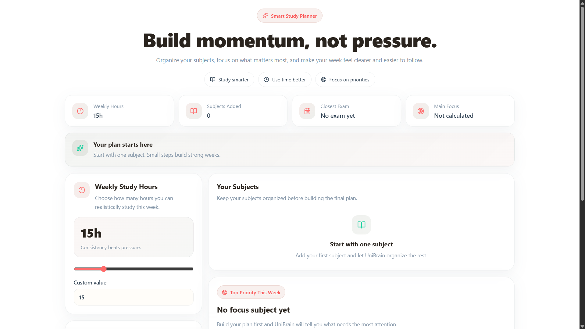
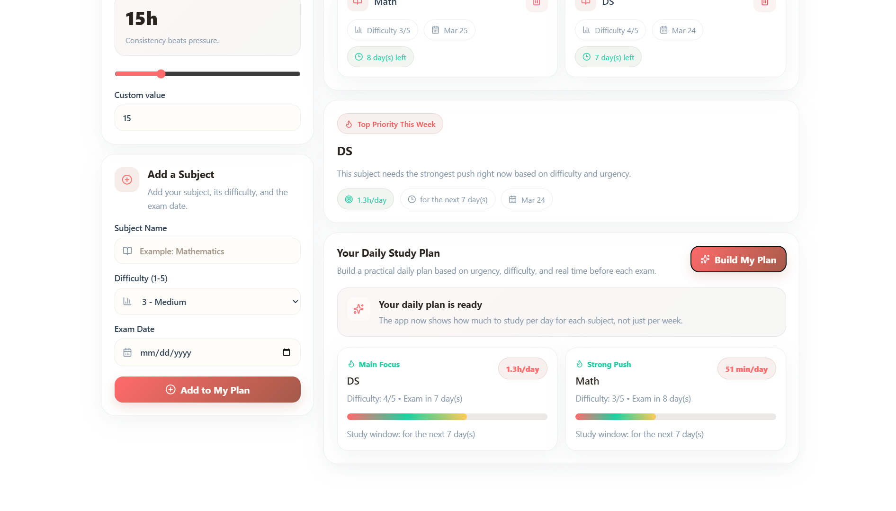

# CramCalm


CramCalm is a **daily study planning web app** built with **React + Vite**.  
It helps students turn a stressful exam schedule into a practical **day-by-day study plan** based on:

- available weekly study hours
- subject difficulty
- exam date proximity

Instead of only showing study time **per week**, CramCalm calculates **how much to study per day** for each subject, making it more useful for revision and exam nights.



---

## Features

### 1. Daily Study Plan Generation
CramCalm generates a **daily study load** for each subject instead of a vague weekly estimate.

- shows results like `2.5h/day` or `45 min/day`
- adapts the plan to the real time available before each exam
- gives a more realistic plan for short exam windows

### 2. Smart Prioritization
Subjects are prioritized using a combination of:

- **difficulty level**
- **exam urgency**

This helps students focus first on the subjects that need the most attention.

### 3. Exam-Aware Time Window
If an exam is close, the app calculates the study recommendation using the actual number of days left before the exam.

Examples:
- if an exam is in **2 days**, the app plans for those **2 days**
- if an exam is farther away, the app uses a **7-day study window**

### 4. Weekly Hours Input
Students can set their total available study hours for the week using:

- a **range slider**
- a **manual numeric input**

### 5. Subject Management
Users can:

- add subjects
- set a difficulty level from **1 to 5**
- choose an exam date
- remove subjects
- clear all subjects

### 6. Top Priority Focus Card
The app highlights the **most important subject** in a dedicated card so the student instantly knows where to start.

### 7. Study Dashboard Overview
The interface includes quick summary cards for:

- weekly study hours
- total subjects added
- closest exam
- current main focus subject

### 8. Motivational UI / UX
CramCalm is designed to feel supportive rather than stressful.

UI touches include:

- clean dashboard layout
- soft, eye-friendly theme
- progress bars
- motivational banner
- lightweight animations
- toast feedback messages

### 9. Local Storage Support
The app stores user data locally in the browser, so refreshing the page does not remove:

- study hours
- subjects list

---

## How the Planning Logic Works
The planning logic is based on:

1. **difficulty score**
2. **urgency score** based on days left until the exam
3. **realistic maximum study window** before the exam

Each subject gets:

- a priority score
- a total allocated study time
- a calculated **daily study load**

This makes the output practical and easier to follow than a generic weekly split.

---

## Tech Stack

- **React**
- **Vite**
- **JavaScript**
- **CSS**
- **Lucide React** for icons
- **localStorage** for persistence

---

## Project Structure

```bash
src/
├── components/
│   ├── Header.jsx
│   ├── StatsRow.jsx
│   ├── MotivationBanner.jsx
│   ├── StudyHoursInput.jsx
│   ├── SubjectForm.jsx
│   ├── SubjectCard.jsx
│   ├── SubjectList.jsx
│   ├── FocusCard.jsx
│   └── PlanResult.jsx
├── utils/
│   └── planner.js
├── App.jsx
├── main.jsx
└── index.css
``
